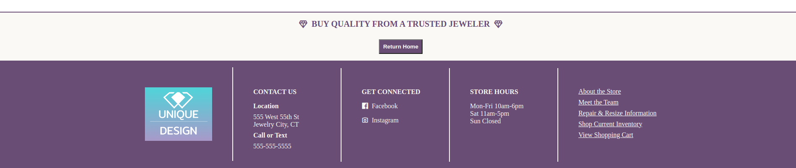

# Jewelry Store Website

**Objective**

I wanted to create a fully working website for a business. I used the Fake Store API, React, JSX, ESLint, Vite, JSON, CSS, and HTML. 

***Images***

Homepage

Custom Design Appointment Page

About Us Page

Meet the Team Page 

Repair Services Page

Appraisals Page

Shop Inventory Page

Cart Page

***Features***

1. All pages have the navigation bar at the top that features:
    a. the business design logo which routes the user back to the homepage when clicked
    b. the About Us, Meet the Team, Repair Services, Appraisals, Shop Inventory, and Cart icon link route the user to the selected page
    c. the Schedule a Custom Design Appointment link will route the user to the custom design page 
    d. the cart icon badge will keep the count of the items in the shopping cart no matter what page the user is on

2. All pages also have a footer that features:
    a. another business design logo which routes the user back to the homepage when clicked
    b. the stores contact information
    c. a space for social media that can be linked at a later time to the businesses social media pages
    d. the store hours
    e. links to all of the pages in the header in a different link list form

3. The business webpage tab features the design logo image and the name of the business. 

4. The Homepage features an image, information about the business, and a section for care plan, shipping, and gift wrapping information.

5. The Custom Design page has information about the custom design process, images, and a form users can fill out to schedule an appointment that alerts the user the form has been submitted. The form also lets the user know if their input is missing or invalid. Right before the footer, users will find a short quote and a button that will route them back to the homepage.

6. The About Us page shows an image of the store, tells about the stores history and current state, and has another short quote and a button that routes the user to the next page, Meet the Team.

7. The Meet the Team page dynamically creates the team member cards for all team members and features a quote and a button that routes users to the Repair Services page.

8. The Repair Services page has an image, information about repair services, and a quote with a button that routes to the Appraisal Information page.

9. The Appraisal Services page has infomation about appraisals, an image, a quote, and a button that routes to the Shopping Page.

10. The Shop Inventory page features three jewelry items. The user can use the add and subtract buttons to increment/decrement items from the cart. The user can also type an amount in the input box if they'd prefer. Users are only able to input numbers into the input boxes. Both ways of adding items will update the cart icon badge on the navagation bar. The data for the shopping page came from Fake Store API and is being rendered dynamically onto the page. The page also features another quote and a button that progresses users to the cart. Users can also access the cart from clicking the navigation bar cart icon.

11. The Cart page shows the order summary from the previous shopping page. The order summary shows the item images, titles, the quantity the user selected for each item, and the item prices. The order total is also displayed. The order total takes the quantity ordered, item price, and totals all three for a final cost. Under the order total the user will find a Continue to Checkout button that when clicked alerts the user it is the end of the website demo and thanks them for viewing the site. The Cart page also has an image, quote, and button to return the user to the homepage. 

***Credits***

1. Pexels.com
    a. Employee Page Photos
    b. Repair Page Photos
